# 白夜平台 — 完整业务流程图

> 覆盖全部 3 层（App 29页 / Server 22路由 / Admin 23视图）+ 25 数据模型 + ~145 API 端点
> 最后更新: 2026-09-06 (自查完善后)

---

## 目录

1. [平台架构总览](#1-平台架构总览)
2. [用户注册 & 登录流程](#2-用户注册--登录流程)
3. [社交发现流程（首页→发现→个人页→关注/聊天）](#3-社交发现流程)
4. [聊天流程（双模架构）](#4-聊天流程双模架构)
5. [礼物系统全流程](#5-礼物系统全流程)
6. [钱包 & 交易流程](#6-钱包--交易流程)
7. [内容社区流程（动态/群组）](#7-内容社区流程)
8. [精英会员流程](#8-精英会员流程)
9. [每日任务流程](#9-每日任务流程)
10. [管理后台运营流程](#10-管理后台运营流程)
11. [数据模型 ER 图](#11-数据模型-er-图)
12. [API 端点全景图](#12-api-端点全景图)
13. [已知问题 & 改进点](#13-已知问题--改进点)

---

## 1. 平台架构总览

```mermaid
graph TB
    subgraph 用户端 App["uni-app 用户端 (29页)"]
        A1[首页 home]
        A2[发现 discover]
        A3[消息 messages/TUIConversation]
        A4[我的 profile]
        A5[聊天 chat]
        A6[礼物商城 gift-shop]
        A7[用户详情 user-profile]
        A8[交易记录 transactions]
        A9[提现 withdraw]
        A10[充值 recharge]
        A11[排行榜 gift-rank]
        A12[精英 elite]
        A13[动态/帖子]
        A14[签到/任务]
    end

    subgraph 管理后台 Admin["Vue3 管理后台 (23视图)"]
        B1[仪表盘 Dashboard]
        B2[用户管理 Users]
        B3[订单管理 Orders]
        B4[服务管理 Services/Categories]
        B5[礼物管理 Gifts]
        B6[聊天记录 ChatRecords]
        B7[配置中心 Settings]
        B8[系统公告 Announcements]
        B9[内容管理 Content/Comments/Reviews]
        B10[发现管理 Posts/Groups]
        B11[运营管理 Banners/SignIns/TaskRecords]
        B12[社交管理 Follows]
        B13[财务管理 Withdrawals/EliteOrders]
        B14[认证管理 Certifications]
        B15[邀请管理 Invite]
    end

    subgraph 后端 Server["Express 后端 (22路由文件)"]
        C1[auth 认证]
        C2[user 用户]
        C3[chat 聊天]
        C4[gifts 礼物]
        C5[wallet 钱包]
        C6[posts 动态]
        C7[groups 群组]
        C8[elite 精英]
        C9[tasks 任务]
        C10[admin 管理]
        C11[config 配置]
        C12[im-sync IM桥接]
    end

    subgraph 数据库 DB["MySQL (25表)"]
        D1[User / Wallet / Transaction]
        D2[Gift / GiftRecord]
        D3[Message / Post / Comment]
        D4[Service / Order / Review]
        D5[Config / DailyTask / Banner]
    end

    subgraph 外部服务
        E1[腾讯IM]
        E2[Redis缓存]
        E3[WebSocket]
        E4[阿里云OSS]
    end

    A1 & A2 & A5 & A6 & A7 & A8 & A9 & A10 & A11 --> C1 & C2 & C3 & C4 & C5 & C6 & C7 & C8 & C9
    B1 & B2 & B3 & B4 & B5 & B6 & B7 & B8 --> C10
    C1 & C2 & C3 & C4 & C5 & C6 & C7 & C8 & C9 & C10 --> D1 & D2 & D3 & D4 & D5
    C3 --> E1 & E3
    C10 --> E2
    C1 --> E4
```

---

## 2. 用户注册 & 登录流程

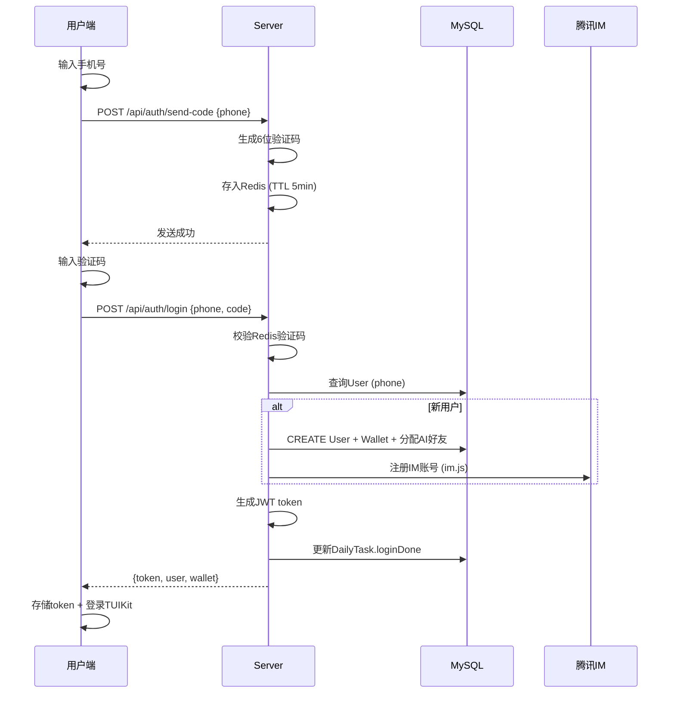

**关键数据流:**
- 新用户自动分配 AI 陪聊用户 (seed.js 预置)
- 钱包初始 diamond=0, giftIncome 在 User 表
- 登录触发每日任务 `loginDone` 标记

---

## 3. 社交发现流程

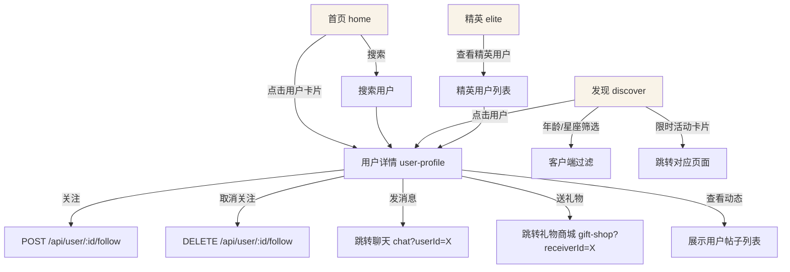

**页面导航关系:**
```
首页 ──→ 用户详情 ──→ 聊天 / 礼物商城 / 关注
发现 ──→ 用户详情 (同上)
精英 ──→ 用户详情 (同上)
```

---

## 4. 聊天流程（双模架构）

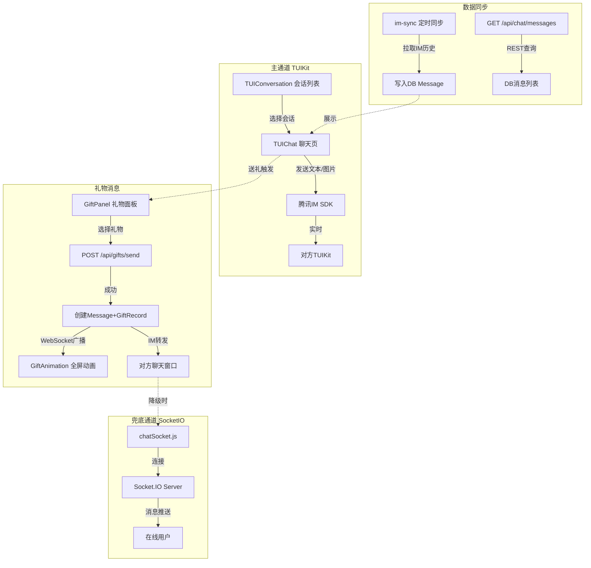

**消息类型:**
| type | 说明 | 来源 |
|------|------|------|
| text | 文本消息 | TUIKit |
| image | 图片消息 | TUIKit |
| gift | 礼物消息 | POST /gifts/send |
| system | 系统通知 | Admin公告 |

---

## 5. 礼物系统全流程

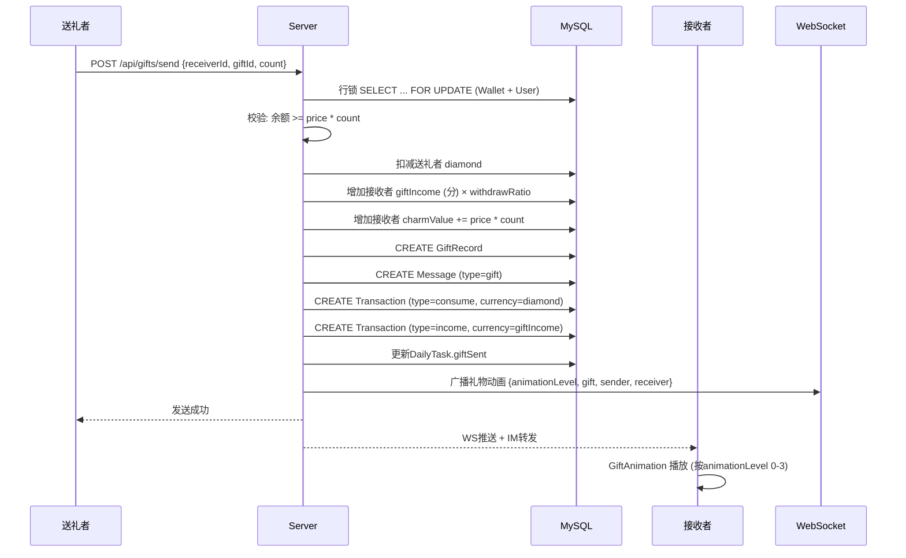

**礼物动画等级:**
| Level | 效果 | 代表礼物 |
|-------|------|---------|
| 0 | 无动画 | 🍭 棒棒糖 (1💎) |
| 1 | 小飘屏+横幅 | 🌹 小红花 (10💎) |
| 2 | 横幅+光效 | 👑 皇冠 (100💎) |
| 3 | 全屏粒子特效 | 🚀 火箭 (500💎+) |

**礼物价格梯度 (16个):**
```
🍭1 → 🌹10 → 🍦20 → ❤️50 → 🎂80 → 👑100 → 💍200 → 🎆300
→ 🏰500 → 🚀500 → 🛥️1000 → 🏎️2000 → ✈️5000 → 🚀🚀10000
→ 🪐20000 → 🌌50000
```

---

## 6. 钱包 & 交易流程

```mermaid
flowchart TD
    subgraph 充值
        A1[充值页 recharge] -->|选择套餐| A2[微信/支付宝支付]
        A2 -->|回调| A3[POST /api/wallet/recharge]
        A3 --> A4[Wallet.diamond += 数量]
        A3 --> A5[Transaction type=recharge]
    end

    subgraph 消费
        B1[送礼] --> B2[Wallet.diamond -= price]
        B2 --> B3[Transaction type=consume, currency=diamond]
    end

    subgraph 收入
        C1[收到礼物] --> C2[User.giftIncome += 金额×ratio]
        C2 --> C3[Transaction type=income, currency=giftIncome]
        C1 --> C4[User.charmValue += 礼物价格]
    end

    subgraph 提现
        D1[提现页 withdraw] -->|选择金额+渠道| D2[POST /api/gifts/withdraw]
        D2 --> D3[User.giftIncome -= 金额]
        D2 --> D4[Transaction type=gift_withdraw]
        D2 --> D5[Admin审核 3态流转]
    end

    subgraph 管理调整
        E1[Admin调整余额] --> E2[POST /admin/users/:id/adjust-balance]
        E2 --> E3[Transaction type=admin_adjustment]
    end

    subgraph 交易记录
        F1[交易记录页 transactions] -->|GET /api/wallet/transactions| F2[展示全部类型]
    end

    style A1 fill:#e8f5e9
    style D1 fill:#fff3e0
    style E1 fill:#fce4ec
```

**Transaction 类型枚举 (11种):**
| type | 货币 | 方向 | 说明 |
|------|------|------|------|
| recharge | diamond | + | 充值钻石 |
| consume | diamond | - | 送礼消费 |
| income | giftIncome(分) | + | 收礼收入 |
| gift_withdraw | giftIncome(分) | - | 礼物提现 |
| withdraw | giftIncome(分) | - | 约玩提现 |
| refund | diamond/分 | + | 退款 |
| reward | diamond | + | 任务/签到奖励 |
| admin_adjustment | 可变 | ± | 管理员手动调整 |
| exchange | - | - | 兑换 |
| elite_pay | diamond | - | 精英会员购买 |
| diamond_unlock_wechat | diamond | - | 扣钻解锁微信号 |

---

## 7. 内容社区流程

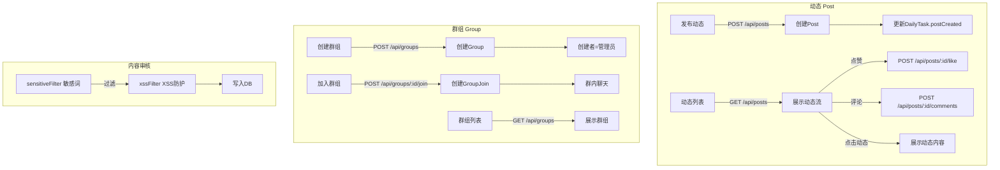

---

## 8. 精英会员流程

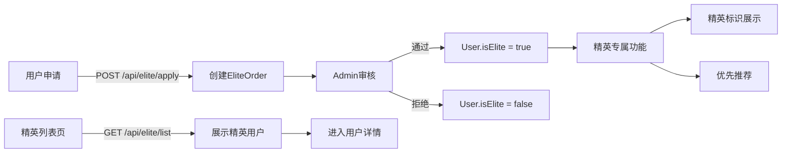

**精英权限:**
- 专属标识 (elite 页展示)
- 优先推荐权重
- 需 `requireElite` 中间件保护的接口

---

## 9. 每日任务流程

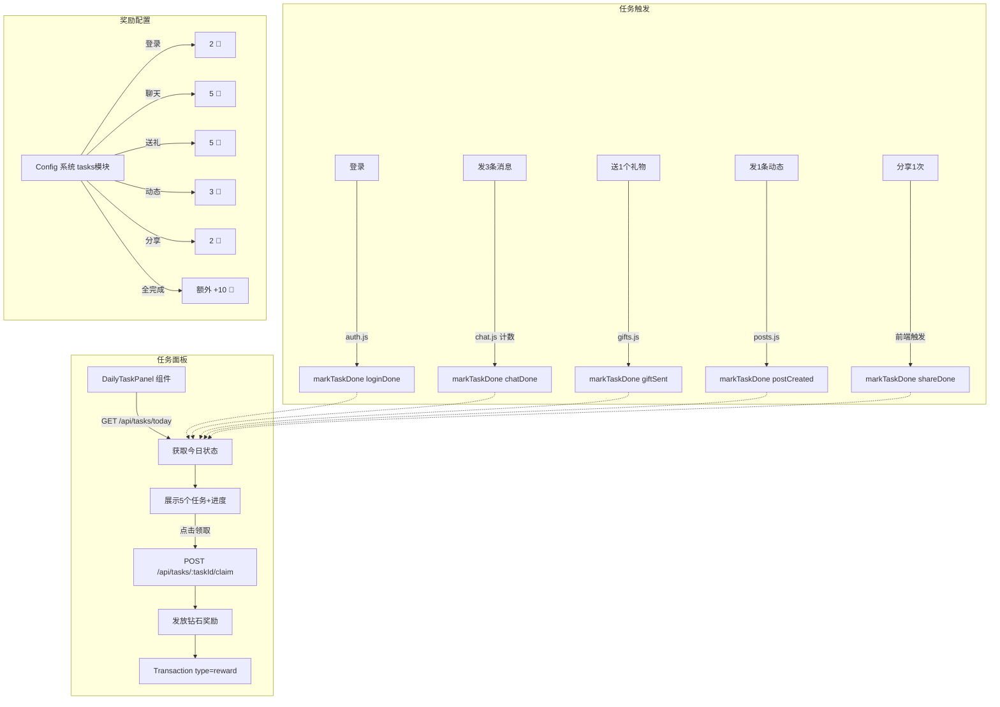

**DailyTask 模型:**
```
userId + date (唯一索引)
├── loginDone: Boolean
├── chatDone: Boolean
├── giftSent: Boolean
├── postCreated: Boolean
├── shareDone: Boolean
└── totalClaimed: Integer (已领取奖励数)
```

---

## 10. 管理后台运营流程

```mermaid
flowchart TD
    subgraph 用户管理
        A1[用户列表] -->|查看详情| A2[用户详情弹窗]
        A2 --> A3[修改余额 adjust-balance]
        A2 --> A4[封禁/解封 ban/unban]
        A2 --> A5[查看礼物数据]
        A2 --> A6[查看调整历史]
    end

    subgraph 礼物管理
        B1[礼物列表 CRUD] -->|新增/编辑| B2[礼物表单]
        B2 --> B3[名称/价格/排序/动画等级]
        B1 -->|删除| B4{检查GiftRecord引用}
        B4 -->|有引用| B5[软删除 active=false]
        B4 -->|无引用| B6[物理删除]
        B7[提现审核] -->|3态流转| B8[待审→已批→已打款]
        B8 --> B9[审核备注+渠道信息]
        B10[送礼记录] -->|查看| B11[全部GiftRecord列表]
        B12[系统配置] -->|修改| B13[withdrawRatio 提现比例]
    end

    subgraph 订单管理
        C1[订单列表] -->|筛选| C2[按状态/用户/时间]
        C1 -->|处理| C3[确认/取消/退款]
    end

    subgraph 内容审核
        D1[聊天审核] -->|查看| D2[消息记录列表]
        D3[公告管理] -->|发布| D4[POST /admin/announcements]
        D4 --> D5[广播给全体/指定用户]
        D6[评论管理] -->|查看/删除| D7[GET/DELETE /admin/comments]
        D8[评价管理] -->|查看/删除| D9[GET/DELETE /admin/reviews]
    end

    subgraph 运营管理
        F1[签到记录] -->|查看| F2[GET /admin/sign-ins]
        F3[任务记录] -->|查看| F4[GET /admin/tasks/records]
        F5[Banner管理] -->|CRUD| F6[/admin/banners]
    end

    subgraph 社交管理
        G1[关注关系] -->|查看| G2[GET /admin/follows]
    end

    subgraph 仪表盘
        E1[Dashboard] -->|展示| E2[用户数/订单数/收入统计]
        E1 --> E3[今日数据趋势]
    end
```

**提现审核 3 态流转:**
```
pending (待审核)
    ├──→ approved (已通过)
    │       └──→ paid (已打款)
    └──→ rejected (已拒绝)
```

---

## 11. 数据模型 ER 图

```mermaid
erDiagram
    User ||--o| Wallet : has
    User ||--o{ Transaction : sends/receives
    User ||--o{ GiftRecord : sends
    User ||--o{ GiftRecord : receives
    User ||--o{ Post : creates
    User ||--o{ Comment : makes
    User ||--o{ Follow : follows
    User ||--o{ Follow : followedBy
    User ||--o{ DailyTask : has
    User ||--o{ Message : sends
    User ||--o{ Order : creates
    User ||--o{ Review : writes
    User ||--o{ GroupJoin : joins
    User ||--o{ Greeting : sends
    User ||--o{ SignIn : has
    User ||--o{ EliteOrder : applies
    User ||--o{ Invite : invites

    Gift ||--o{ GiftRecord : referenced
    Service ||--o{ Order : creates
    ServiceCategory ||--o{ Service : categorizes
    Post ||--o{ Comment : has
    Group ||--o{ GroupJoin : has

    User {
        BIGINT id PK
        VARCHAR phone
        VARCHAR nickname
        VARCHAR avatar
        TEXT bio
        INTEGER giftIncome "分"
        INTEGER charmValue
        BOOLEAN isElite
        BOOLEAN isBanned
        JSON extra "封禁原因等"
    }

    Wallet {
        BIGINT id PK
        BIGINT userId FK
        INTEGER diamond
    }

    Gift {
        BIGINT id PK
        VARCHAR name
        VARCHAR imageUrl
        INTEGER price
        INTEGER sort
        INTEGER animationLevel "0-3"
        BOOLEAN active
    }

    GiftRecord {
        BIGINT id PK
        BIGINT senderId FK
        BIGINT receiverId FK
        BIGINT giftId FK
        INTEGER count
        INTEGER totalPrice
    }

    Transaction {
        BIGINT id PK
        BIGINT userId FK
        VARCHAR type "ENUM 11种"
        DECIMAL amount
        VARCHAR currency "diamond/giftIncome"
        TEXT remark
        JSON extra
    }

    Message {
        BIGINT id PK
        BIGINT senderId FK
        BIGINT receiverId FK
        VARCHAR type "text/image/gift/system"
        TEXT content
        JSON extra "giftId等"
    }

    DailyTask {
        BIGINT id PK
        BIGINT userId FK
        DATE date
        BOOLEAN loginDone
        BOOLEAN chatDone
        BOOLEAN giftSent
        BOOLEAN postCreated
        BOOLEAN shareDone
        INTEGER totalClaimed
    }

    Config {
        BIGINT id PK
        VARCHAR module
        VARCHAR key
        TEXT value
    }
```

---

## 12. API 端点全景图

### 用户端 API (app → server)

| 模块 | 端点 | 说明 |
|------|------|------|
| **认证** | POST /api/auth/send-code | 发送验证码 |
| | POST /api/auth/login | 手机登录 |
| | POST /api/auth/wx-login | 微信登录 |
| **用户** | GET /api/user/profile | 获取个人信息 |
| | PUT /api/user/profile | 修改个人信息 |
| | GET /api/user/:id | 查看他人主页 |
| | POST /api/user/:id/follow | 关注 |
| | DELETE /api/user/:id/follow | 取消关注 |
| | GET /api/user/:id/followers | 粉丝列表 |
| | GET /api/user/:id/following | 关注列表 |
| **聊天** | GET /api/chat/conversations | 会话列表 |
| | GET /api/chat/messages | 消息记录 |
| | POST /api/chat/messages | 发送消息(兜底) |
| **礼物** | GET /api/gifts | 礼物列表 |
| | POST /api/gifts/send | 送礼 |
| | GET /api/gifts/income | 礼物收入 |
| | GET /api/gifts/records | 送礼记录 |
| | GET /api/gifts/rank | 排行榜 |
| | POST /api/gifts/withdraw | 提现申请 |
| **钱包** | GET /api/wallet/balance | 余额 |
| | GET /api/wallet/transactions | 交易记录 |
| | POST /api/wallet/recharge | 充值 |
| **动态** | GET /api/posts | 动态列表 |
| | POST /api/posts | 发布动态 |
| | POST /api/posts/:id/like | 点赞 |
| | POST /api/posts/:id/comments | 评论 |
| **任务** | GET /api/tasks/today | 今日任务 |
| | POST /api/tasks/:taskId/claim | 领取奖励 |
| **精英** | GET /api/elite/list | 精英列表 |
| | POST /api/elite/apply | 申请精英 |

### 管理后台 API (admin → server)

| 模块 | 端点 | 说明 |
|------|------|------|
| **仪表盘** | GET /admin/dashboard | 统计数据 |
| **用户** | GET /admin/users | 用户列表 |
| | GET /admin/users/:id | 用户详情+礼物数据 |
| | POST /admin/users/:id/adjust-balance | 调整余额 |
| | GET /admin/users/:id/balance-history | 调整历史 |
| | PUT /admin/users/:id/ban | 封禁 |
| | PUT /admin/users/:id/unban | 解封 |
| **礼物** | GET /admin/gifts | 礼物列表 |
| | POST /admin/gifts | 创建礼物 |
| | PUT /admin/gifts/:id | 编辑礼物 |
| | DELETE /admin/gifts/:id | 删除礼物 |
| | GET /admin/gifts/withdrawals | 提现列表 |
| | PUT /admin/gifts/withdrawals/:id/audit | 审核提现 |
| | GET /admin/gifts/records | 送礼记录 |
| | GET /admin/gifts/config | 获取配置 |
| | PUT /admin/gifts/config | 更新配置 |
| **订单** | GET /admin/orders | 订单列表 |
| | PUT /admin/orders/:id | 处理订单 |
| **内容** | GET /admin/feedback | 反馈列表 |
| | PUT /admin/feedback/:id | 处理反馈 |
| | GET /admin/comments | 评论列表 |
| | DELETE /admin/comments/:id | 删除评论 |
| | GET /admin/reviews | 评价列表 |
| | DELETE /admin/reviews/:id | 删除评价 |
| **运营** | GET /admin/sign-ins | 签到记录 |
| | GET /admin/sign-ins/stats | 签到统计 |
| | GET /admin/tasks/records | 任务记录 |
| **社交** | GET /admin/follows | 关注关系列表 |
| **发现** | GET /admin/posts | 动态列表 |
| | PUT /admin/posts/:id/audit | 审核动态 |
| | DELETE /admin/posts/:id | 删除动态 |
| | GET /admin/groups | 群组列表 |
| | DELETE /admin/groups/:id | 删除群组 |
| **公告** | POST /admin/announcements | 发布公告 |
| | GET /admin/announcements | 公告列表 |
| **认证** | GET /admin/certifications | 认证列表 |
| | PUT /admin/certifications/:id/audit | 审核认证 |
| **配置** | GET /admin/config/modules | 配置模块列表 |
| | GET /admin/config/modules/:name | 模块详情 |
| | PUT /admin/config/modules/:name | 更新配置 |

---

## 13. 已知问题 & 改进点

### ✅ 已修复 (本轮自查)

| # | 问题 | 修复方式 |
|---|------|---------|
| 1 | Transaction ENUM 缺少 `elite_pay`/`diamond_unlock_wechat` | 补全 ENUM 值 |
| 2 | transactions.vue 交易类型映射不全 | 补充所有 11 种类型标签+图标 |
| 3 | im-sync 不触发每日任务 markChat | 在 im-sync 端点添加 markChat 调用 |
| 4 | admin 退款使用废弃 starCoin | 改为 diamond |
| 5 | wallet.js 签到 Transaction 多余 kind 字段 | 移除冗余字段 |
| 6 | 礼物删除无级联保护 | 有 GiftRecord 引用时改为软删除(active=false) |
| 7 | 管理后台缺少 5 个模块 | 新增评论/评价/签到/任务/关注管理页面 |
| 8 | 配置中心缺少 tasks 模块元数据 | 添加 MODULE_META + FIELD_LABELS + collectTemplate |
| 9 | 侧边栏未包含新页面 | 重构 Layout.vue 菜单结构 |

### 🟡 P1 — 待改进

| # | 问题 | 位置 | 影响 |
|---|------|------|------|
| 1 | 用户端无送礼记录页面 | giftApi.records() 未使用 | 用户无法查看送礼历史 |
| 2 | 提现审核列表 JS 内存过滤 | admin.js withdrawals | 数据量大时性能差 |

### 🟡 P2 — 体验优化

| # | 问题 | 位置 | 影响 |
|---|------|------|------|
| 3 | gift-shop 未用 guard/unwrap | gift-shop.vue:138 | API 响应处理不一致 |
| 4 | Admin 礼物表单无图片上传 | admin gifts/index.vue | 只能手动输入 URL |

### 改进路线图

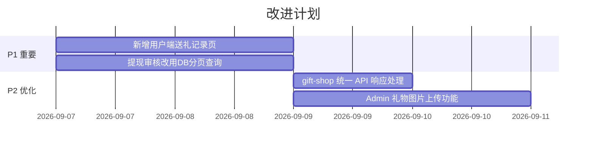

---

## 附录: 页面导航地图

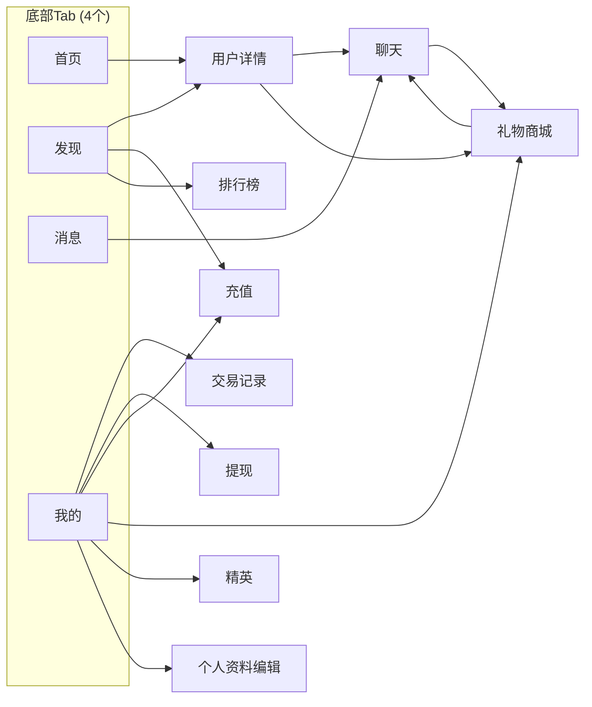

---

## 附录: 管理后台侧边栏结构

```
├── 仪表盘          /dashboard
├── 用户管理        /users
├── 聊天记录        /chat-records
├── 订单管理        /orders
├── 邀请管理        /invite
├── 礼物管理        /gifts
├── 内容管理 ▸
│   ├── 反馈管理    /content
│   ├── 评论管理    /content/comments
│   └── 评价管理    /content/reviews
├── 发现管理 ▸
│   ├── 动态管理    /discover/posts
│   └── 组局管理    /discover/groups
├── 社交管理 ▸
│   └── 关注关系    /social/follows
├── 运营管理 ▸
│   ├── Banner 管理 /operations/banners
│   ├── 系统公告    /operations/announcements
│   ├── 签到记录    /operations/sign-ins
│   └── 任务记录    /operations/task-records
├── 财务管理 ▸
│   ├── 提现审核    /finance
│   └── 精英订单    /finance/elite-orders
├── 服务管理 ▸
│   ├── 服务审核    /services
│   └── 分类管理    /services/categories
├── 认证管理 ▸
│   └── 实名认证    /auth/certifications
└── 配置中心        /settings
```

---

*本文档基于代码分析自动生成，已根据 2026-09-06 自查结果同步更新。建议每次大版本更新后刷新。*
