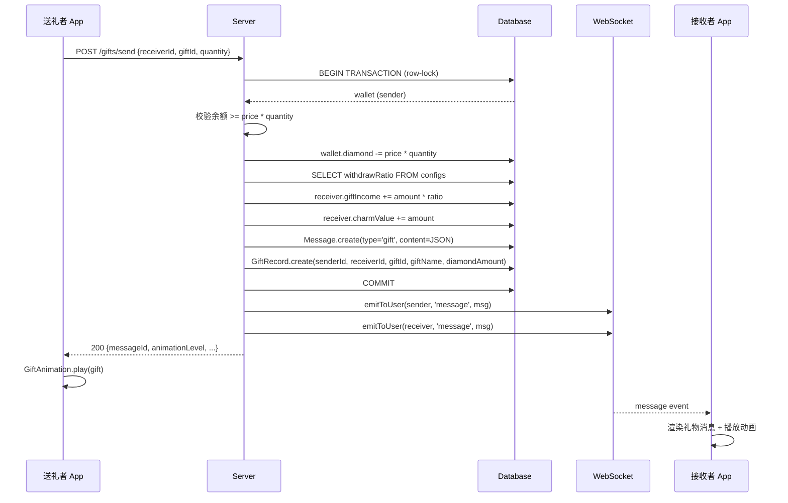
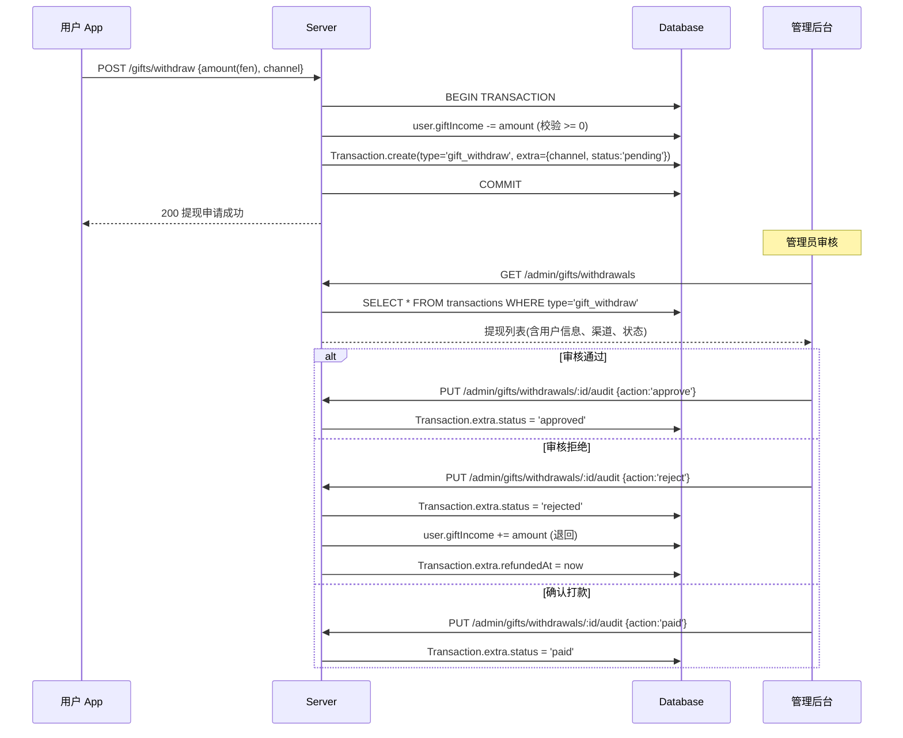
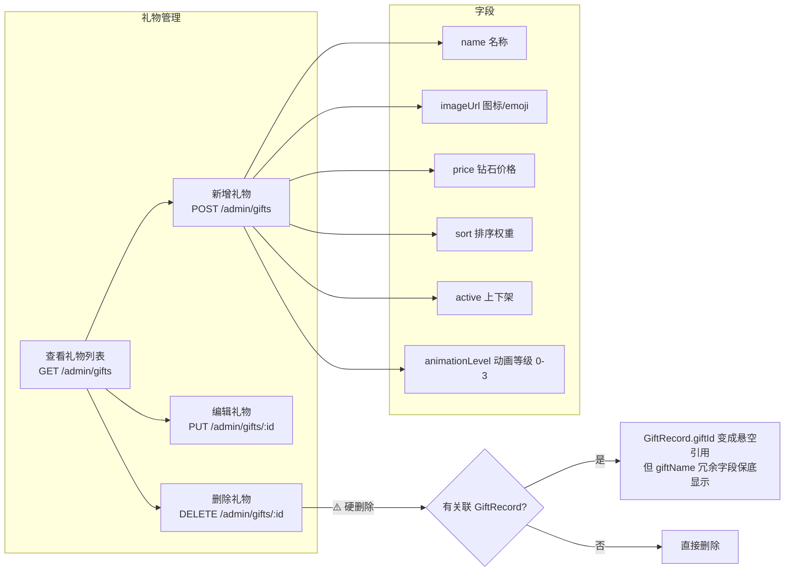
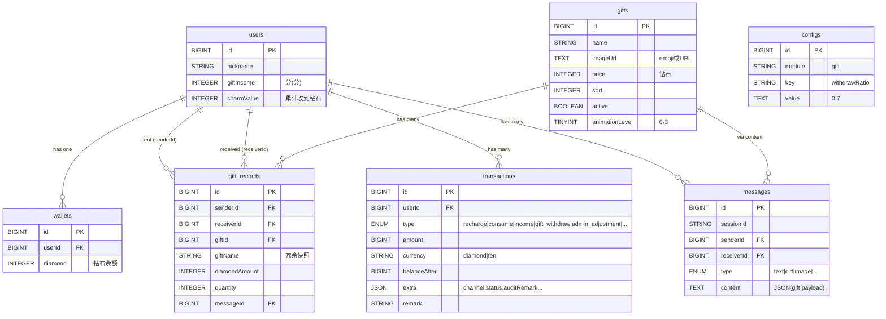
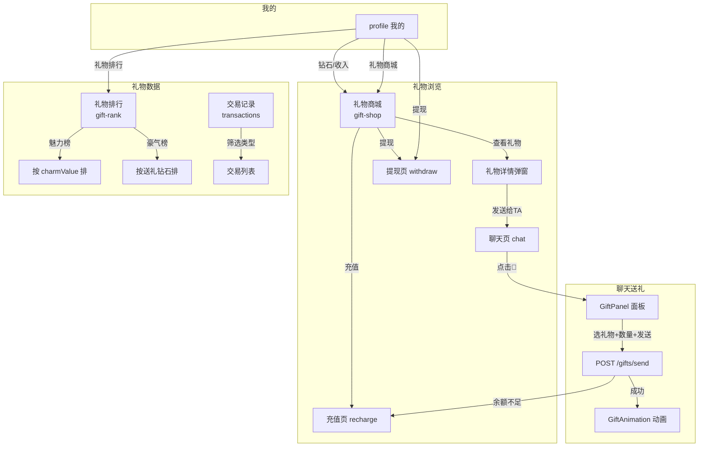

# 白夜礼物系统 — 业务流程图 & 数据流

> 用于指导后续开发完善，标注了当前断裂点

---

## 一、系统全景架构

```mermaid
graph TB
    subgraph APP["用户端 App"]
        GS[礼物商城<br>gift-shop.vue]
        GP[聊天送礼面板<br>GiftPanel.vue]
        GA[礼物动画<br>GiftAnimation.vue]
        GR[礼物排行榜<br>gift-rank.vue]
        WD[礼物提现<br>withdraw.vue]
        TX[交易记录<br>transactions.vue]
        WP[我的钱包<br>profile.vue]
    end

    subgraph ADMIN["管理后台 Admin"]
        AG[礼物管理 CRUD<br>gifts/index.vue Tab1]
        AW[提现审核<br>gifts/index.vue Tab2]
        AR[送礼记录<br>gifts/index.vue Tab3]
        AC[系统配置<br>gifts/index.vue Tab4]
        AB[余额调整<br>users/Users.vue]
    end

    subgraph SERVER["后端 API Server"]
        direction TB
        R1[GET /api/gifts]
        R2[POST /api/gifts/send]
        R3[GET /api/gifts/records]
        R4[GET /api/gifts/rank]
        R5[POST /api/gifts/withdraw]
        R6[GET /api/gifts/income]
        R7[GET /api/wallet/balance]
        R8[GET /api/wallet/transactions]
        RA1[GET /api/admin/gifts]
        RA2[POST/PUT/DELETE /api/admin/gifts]
        RA3[GET /api/admin/gifts/withdrawals]
        RA4[PUT /api/admin/gifts/withdrawals/:id/audit]
        RA5[GET /api/admin/gifts/records]
        RA6[GET/PUT /api/admin/gifts/config]
    end

    subgraph DB["数据库 MySQL"]
        GIFT[gifts 表]
        GR2[gift_records 表]
        TX2[transactions 表]
        MSG[messages 表]
        USR[users 表]
        WLT[wallets 表]
        CFG[configs 表]
    end

    GS --> R1
    GP --> R2
    GP --> R7
    GR --> R4
    WD --> R5
    TX --> R8
    WP --> R7

    AG --> RA1
    AG --> RA2
    AW --> RA3
    AW --> RA4
    AR --> RA5
    AC --> RA6
    AB -->|调整余额| R2

    R1 --> GIFT
    R2 -->|事务| GIFT
    R2 -->|事务| GR2
    R2 -->|事务| MSG
    R2 -->|事务| USR
    R2 -->|事务| WLT
    R3 --> GR2
    R4 --> GR2
    R4 --> USR
    R5 --> USR
    R5 --> TX2
    R6 --> USR
    R7 --> WLT
    R7 --> USR
    R8 --> TX2
    RA1 --> GIFT
    RA2 --> GIFT
    RA3 --> TX2
    RA4 --> TX2
    RA4 --> USR
    RA5 --> GR2
    RA6 --> CFG
```

---

## 二、送礼核心流程（时序图）

---

## 三、礼物提现流程

---

## 四、管理后台礼物 CRUD 流程

---

## 五、数据模型关系图

---

## 六、用户端页面功能地图

---

## 七、已发现的数据断裂点

### 🔴 问题 1：交易记录缺少 gift_withdraw 类型

| 位置 | 问题 |
|------|------|
| `app/src/pages/transactions/transactions.vue:64` | `typeMap` 只有 7 种类型，缺少 `gift_withdraw` |
| 影响 | 用户发起礼物提现后，在交易记录中显示为"其他交易"，金额方向也错误 |

**修复**: typeMap 追加 `gift_withdraw: '礼物提现'`，INCOME_TYPES 不含此项（提现是扣减）

### 🔴 问题 2：管理后台删除礼物无保护

| 位置 | 问题 |
|------|------|
| `server/src/routes/admin.js` DELETE `/admin/gifts/:id` | 硬删除，不检查是否有关联 GiftRecord |
| 影响 | 删除后 GiftRecord.giftId 悬空，历史送礼记录的礼物图片/详情无法显示 |

**修复方案**:
- 方案A：改为软删除（`active = false`），管理后台标记"已下架"
- 方案B：有 GiftRecord 引用时禁止删除，只能下架

### 🟡 问题 3：管理后台提现列表用内存过滤

| 位置 | 问题 |
|------|------|
| `server/src/routes/admin.js` GET `/admin/gifts/withdrawals` | 加载全部 gift_withdraw 记录后在 JS 中 filter/paginate |
| 影响 | 数据量大时性能差，且分页不准确 |

**修复**: 改为 SQL WHERE 条件过滤 + 数据库分页

### 🟡 问题 4：礼物商城 API 响应解析不一致

| 位置 | 问题 |
|------|------|
| `app/src/pages/gift-shop/gift-shop.vue:138` | `res.data` 直接取，未用 `guard/unwrap` 收敛 |
| `app/src/pages/gift-shop/gift-shop.vue:150` | `res.data?.giftIncome` 同上 |
| 影响 | 如果 API 响应格式变化或网络异常，页面静默空白 |

**修复**: 统一使用 `guard()` + `unwrap()` 处理

### 🟡 问题 5：用户端缺少"我的送礼/收礼记录"页面

| 位置 | 问题 |
|------|------|
| 用户端 | `giftApi.records()` API 已定义但无页面调用 |
| 影响 | 用户无法查看自己送出/收到的礼物历史（管理后台有，用户端没有） |

**修复**: 在礼物商城或个人页增加"送礼记录"入口

### 🟡 问题 6：管理后台缺少礼物图片上传

| 位置 | 问题 |
|------|------|
| `admin/src/views/gifts/index.vue` | 礼物表单中 imageUrl 是手动输入文本框 |
| 影响 | 管理员无法直接上传图片作为礼物图标，只能手动粘贴 URL |

**修复**: 图片 URL 输入框旁增加"上传"按钮，调用 upload API

---

## 八、完整 API 端点对照表

| 功能 | 用户端 API | 管理后台 API | 前端调用方 |
|------|-----------|-------------|-----------|
| 礼物列表 | GET `/gifts` (仅 active) | GET `/admin/gifts` (全部) | GiftPanel, gift-shop / admin gifts Tab1 |
| 送礼 | POST `/gifts/send` | — | GiftPanel |
| 礼物收入 | GET `/gifts/income` | — | gift-shop |
| 送礼记录 | GET `/gifts/records` | GET `/admin/gifts/records` | ⚠️ 用户端无页面 / admin Tab3 |
| 排行榜 | GET `/gifts/rank` | — | gift-rank |
| 礼物提现 | POST `/gifts/withdraw` | — | withdraw.vue |
| 提现列表 | — | GET `/admin/gifts/withdrawals` | admin Tab2 |
| 提现审核 | — | PUT `/admin/gifts/withdrawals/:id/audit` | admin Tab2 |
| 新增礼物 | — | POST `/admin/gifts` | admin Tab1 |
| 编辑礼物 | — | PUT `/admin/gifts/:id` | admin Tab1 |
| 删除礼物 | — | DELETE `/admin/gifts/:id` | admin Tab1 |
| 提现比例 | — | GET/PUT `/admin/gifts/config` | admin Tab4 |
| 余额调整 | — | POST `/admin/users/:id/adjust-balance` | admin Users |
| 钱包余额 | GET `/wallet/balance` | — | wallet store |
| 交易记录 | GET `/wallet/transactions` | — | transactions.vue |

---

## 九、修复优先级

| 优先级 | 问题 | 工作量 | 影响 |
|--------|------|--------|------|
| P0 | 🔴 交易记录缺 gift_withdraw | 5 分钟 | 用户看到错误信息 |
| P0 | 🔴 删除礼物无保护 | 15 分钟 | 历史数据断裂 |
| P1 | 🟡 用户端缺送礼记录页 | 30 分钟 | 功能缺失 |
| P1 | 🟡 提现列表内存过滤 | 20 分钟 | 性能隐患 |
| P2 | 🟡 gift-shop API 收敛 | 10 分钟 | 健壮性 |
| P2 | 🟡 管理后台图片上传 | 20 分钟 | 运营体验 |
